# Домашнее задание к занятию 3 «Резервное копирование» Шелухин Юрий

### Чеклист готовности к домашнему заданию

1. Установлена операционная система Ubuntu на виртуальную машину и имеется доступ к терминалу
2. Сделан клон этой виртуальной машины с другим IP адресом

---

### Задание 1
- Составьте команду rsync, которая позволяет создавать зеркальную копию домашней директории пользователя в директорию `/tmp/backup`
- Необходимо исключить из синхронизации все директории, начинающиеся с точки (скрытые)
- Необходимо сделать так, чтобы rsync подсчитывал хэш-суммы для всех файлов, даже если их время модификации и размер идентичны в источнике и приемнике.
- На проверку направить скриншот с командой и результатом ее выполнения


# Решение 1.
1. Cоздадим зеркальную копию домашней директории пользователя в директорию /tmp/backup.  
`rsync -a --progress ~ /tmp/backup`  
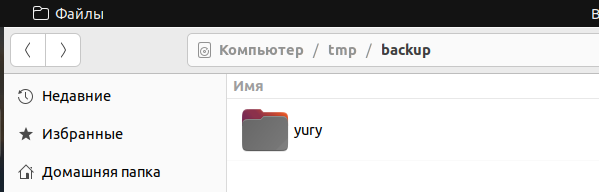  

2. Исключим из синхронизации все директории, начинающиеся с точки (скрытые).    
`rsync -a --exclude='.*/' ~ /tmp/backup`
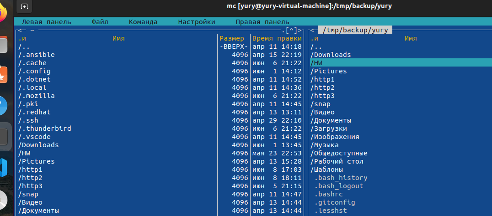   

3. Cделаем так, чтобы rsync подсчитывал хэш-суммы для всех файлов, даже если их время модификации и размер идентичны в источнике и приемнике.    
`rsync -ac --progress --exclude='.*/' ~ /tmp/backup`
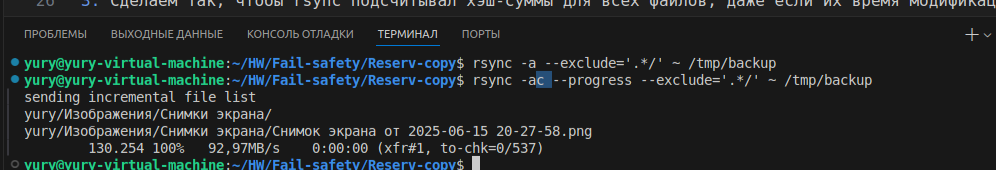

---

### Задание 2
- Написать скрипт и настроить задачу на регулярное резервное копирование домашней директории пользователя с помощью rsync и cron.
- Резервная копия должна быть полностью зеркальной
- Резервная копия должна создаваться раз в день, в системном логе должна появляться запись об успешном или неуспешном выполнении операции
- Резервная копия размещается локально, в директории `/tmp/backup`
- На проверку направить файл crontab и скриншот с результатом работы утилиты.

---

# Решение 2.
1. Добавим задачу в cron.  
`sudo crontab -e`  
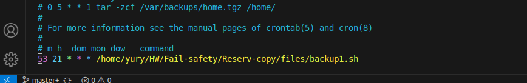  

2. Напишем скрипт.
```
#!/bin/bash

# команда rsync. Cтандартный вывод - в /dev/null, ошибки - в лог
rsync -ac --delete /home/yury /tmp/backup > /dev/null 2>> /var/log/backup.log

# проверка кода завершения rsync и запись лога
if [ $? -eq 0 ]; then
    echo "[$(date)] - резервное копирование успешно выполнено" >> /var/log/backup.log
else
    echo "[$(date)] - ошибка при выполнении резервного копирования" >> /var/log/backup.log
fi
```
Сделаем скрипт исполняемым.  
`chmod +x /home/yury/HW/Fail-safety/Reserv-copy/files/backup1.sh`  
3. Проверим создание копии.  
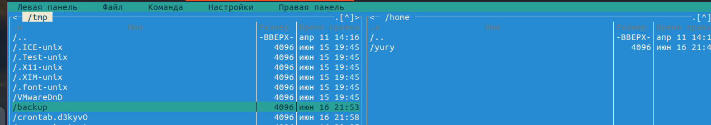  
4. Проверим лог  
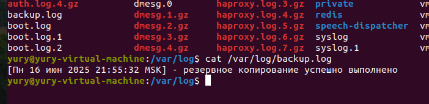  

### Использован следующий скрипт.  
[скрипт](files/backup1.sh)  

---

### Задание 3*
- Настройте ограничение на используемую пропускную способность rsync до 1 Мбит/c
- Проверьте настройку, синхронизируя большой файл между двумя серверами
- На проверку направьте команду и результат ее выполнения в виде скриншота

---

# Решение 3*.
1. Создадим файл 20 Мб.    
`dd if=/dev/random of=/home/yury/HW/Fail-safety/Reserv-copy/files/large_file bs=2M count=10`    
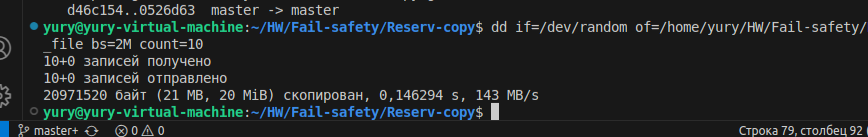  

2. Запустим команду rsync с ограничениями.    
`rsync -avP --bwlimit=1000 --checksum /home/yury/HW/Fail-safety/Reserv-copy/files/large_file yury@192.168.65.136:/home/yury/HW/large_file`   
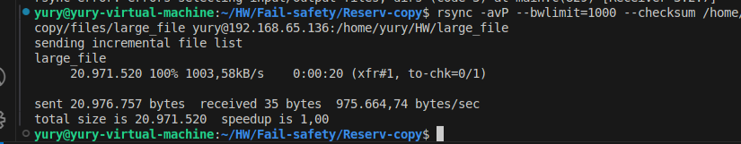    


---

### Задание 4*
- Напишите скрипт, который будет производить инкрементное резервное копирование домашней директории пользователя с помощью rsync на другой сервер
- Скрипт должен удалять старые резервные копии (сохранять только последние 5 штук)
- Напишите скрипт управления резервными копиями, в нем можно выбрать резервную копию и данные восстановятся к состоянию на момент создания данной резервной копии.
- На проверку направьте скрипт и скриншоты, демонстрирующие его работу в различных сценариях.

---

# Решение 4*.
1. Скрипт запускается с параметрами -run (производится бэкап) или -list (выводится список бэкапов и таким образом выберите нужный для восстановления). Пакеты для хранения на удаленном расстоянии. Каждый следующий бэкап-линкуется с альтернативным бэкапом (опция --link-dest, определите жесткую ссылку), таким образом экономится место на диске удалённого сервера, дублируясь между бэкапами файлов, которые являются жесткими ссылками, и при удалении файлов бэкапа все пересекающиеся файлы остаются доступными в других бэкапах.
2. Проверим работу скрипта, запустив его несколько раз.    
`bash -x backup2.sh -run`    
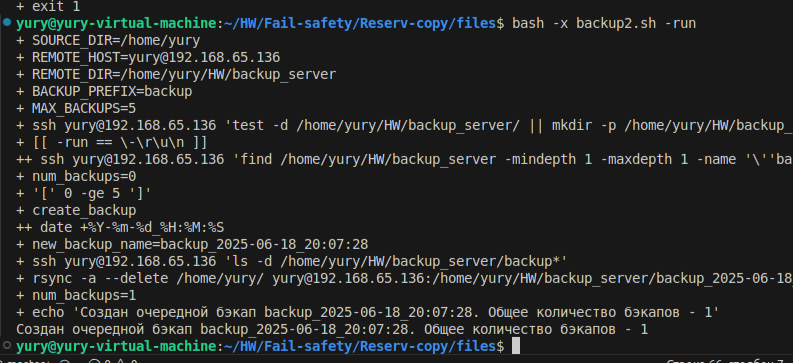  
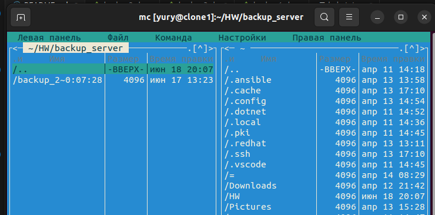
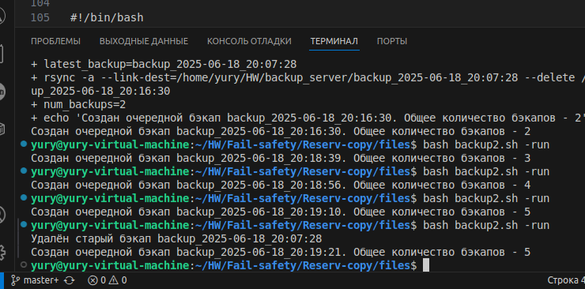
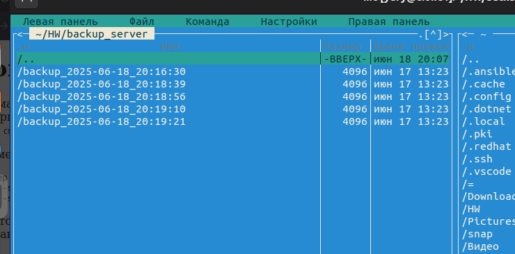  

3. Проверим возможность восстановления. Введем заведомо некорректный номер для проверки работы.  
`bash backup2.sh -list`  
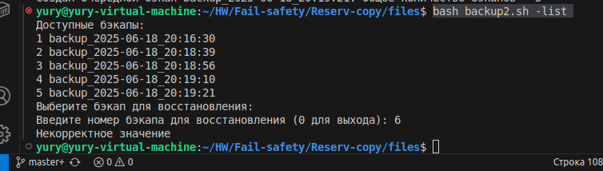  

### Использован следующий скрипт.  
[скрипт](files/backup2.sh)  

---


